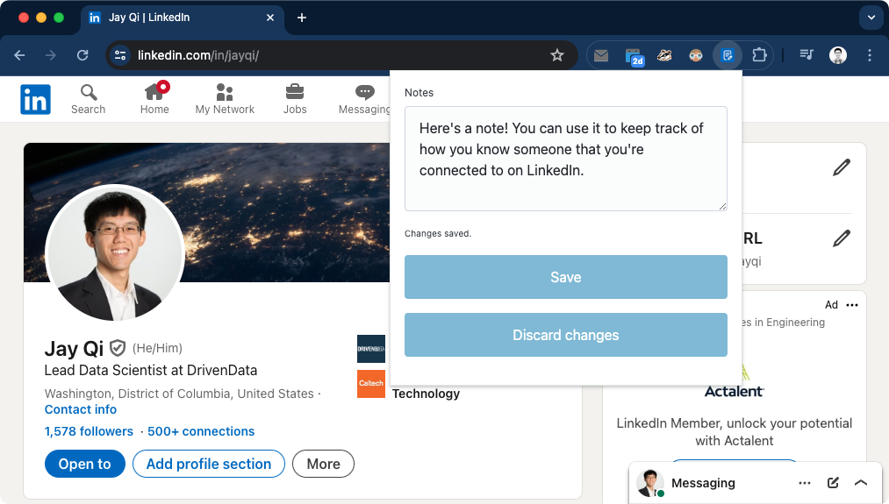

# LinkedIn Notes

> [!WARNING]
> This software is highly experimental and may have breaking changes.

**LinkedIn Notes** is Chrome browser extension for recording simple text notes associated with LinkedIn profile pages, backed by a local SQLite database.

Key features:

- **Open source.** All source code for LinkedIn Notes is in this repository.
- **Your data is entirely local.** Notes are saved to a SQLite database on your local filesystem. Unsaved changes are cached in the local storage provided by your browser for extensions. No data is ever transmitted off of your system.
- **Your data is portable.** All of your data is saved to a single table in the most widely used single-file database. You can use any program capable of reading from a SQLite database to access your data.



## How it works

There are two components to LinkedIn Notes:

1. A Chrome browser extension that loads and saves text notes when your active tab is a LinkedIn profile page.
2. A Python package that runs a native messaging host script that serves as a backend storage service.

[Native messaging](https://developer.mozilla.org/en-US/docs/Mozilla/Add-ons/WebExtensions/Native_messaging) is a modern web browser protocol that allows browser extensions to talk to native applications running on your computer. LinkedIn Notes uses a native application (a Python script) to read from and write to a local SQLite database.

## Installation and set up

> [!IMPORTANT]
> Setting up LinkedIn Notes requires familiarity with running shell commands and installing Python packages.

> [!NOTE]
> This documentation is still a work in progress. More detailed instructions will be added.

1. Install the browser extension.
2. Install the `linkedin-notes-storage` Python package.
3. Set up the native messaging host by running the following shell command:

    ```bash
    linkedin-notes-storage setup
    ```

## Storage

There are two kinds of data storage involved in LinkedIn Notes. Both are entirely local to your computer's filesystem.

Firstly, LinkedIn Notes saves your notes to a local [SQLite](https://www.sqlite.org/) database. Without the database, you'd be at risk of losing your notes, as the storage that browsers provide to extensions gets deleted if the extension is ever uninstalled.

Secondly, LinkedIn Notes uses the browser-provided local storage as a cache for unsaved changes to notes. This cache will be deleted if you uninstall the browser extension.

### Managing the database

You can use the `linkedin-notes-storage database` subgroup of CLI commands to manage the local SQlite database file.
